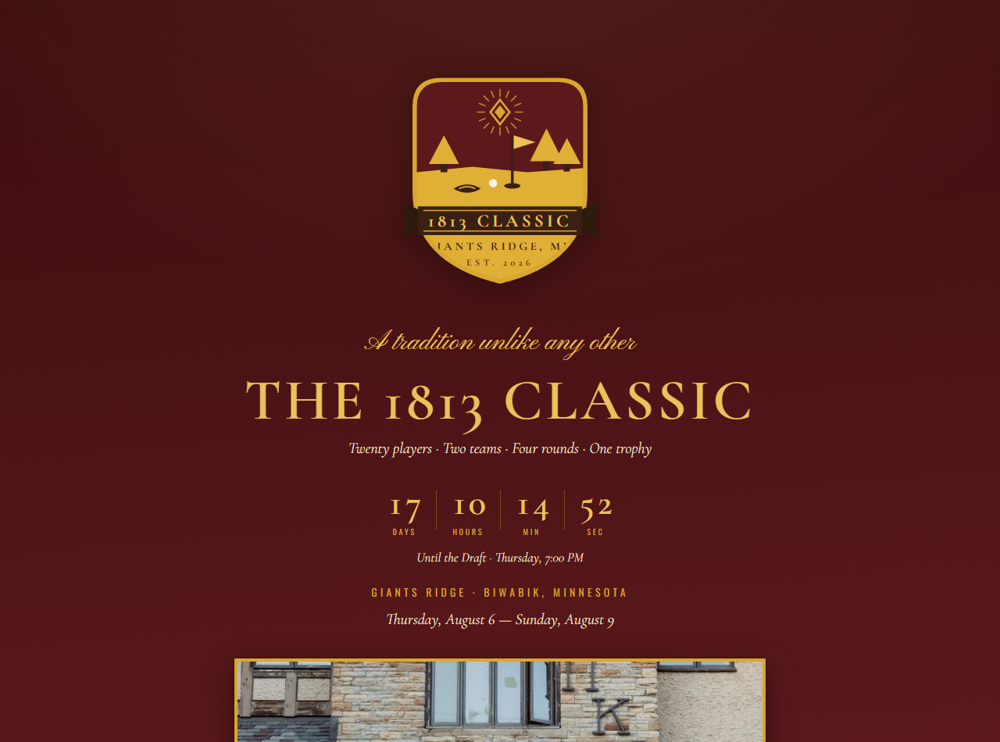

# The 1813 Classic — Giants Ridge · Aug 6–9, 2026

**Live site: [bjornswanson0.github.io/1813-Classic-2026](https://bjornswanson0.github.io/1813-Classic-2026/)**

The official site of the inaugural 1813 Classic: four days, twenty players, two teams, one trophy at Giants Ridge in Biwabik, Minnesota. A trip like this generates a hundred group-chat questions — who's on whose team, what time is the first tee, what's the format, who's buying the food — so the answers got a permanent home, styled like a tournament that takes itself exactly the right amount of too seriously.

## What's on it

- Live countdown to the draft, the full schedule, and the twenty-man field
- Team format and the stakes (the losers buy the food)
- Live leaderboard
- PWA manifest and icons, so it installs to a home screen like an app
- Social-share cards for dropping the link back into the group chat

## Stack

Hand-written HTML, CSS, and vanilla JavaScript on GitHub Pages.
